# TransactX – Enterprise Banking Core & ATM Simulator

TransactX is a **production-quality ATM Transaction Simulator** that replicates the backend and database architecture of a modern retail banking system. It demonstrates key enterprise banking concepts such as transactional integrity (ACID), concurrency control, optimistic and pessimistic locking, deadlock prevention, double-entry ledgers, and token security, coupled with a glassmorphic dashboard interface.

---

## 1. System Architecture & Flow

```
   ┌────────────────────────────────────────────────────────┐
   │                     React Frontend                     │
   └──────────────────────────┬─────────────────────────────┘
                              │ HTTPS REST API
                              ▼
   ┌────────────────────────────────────────────────────────┐
   │            Spring Boot Security / JWT Filter           │
   └──────────────────────────┬─────────────────────────────┘
                              │
                              ▼
   ┌────────────────────────────────────────────────────────┐
   │              REST Controllers (Deduplication)          │
   └──────────────────────────┬─────────────────────────────┘
                              │
                              ▼
   ┌────────────────────────────────────────────────────────┐
   │                     Service Layer                      │
   │      (Ordered Locks, Cache check, Ledgers posting)      │
   └──────────────────────────┬─────────────────────────────┘
                              │
                              ▼
   ┌──────────────────────────┴─────────────────────────────┐
   │                 Database Persistence Layer             │
   └──────────────┬───────────────────────────┬─────────────┘
                  │                           │
                  ▼                           ▼
   ┌─────────────────────────────┐    ┌─────────────────────┐
   │     PostgreSQL Database     │    │  Upstash Redis Cache│
   │  (Accounts, Audits, Ledgers)│    │ (Blacklist/Locks)   │
   └─────────────────────────────┘    └─────────────────────┘
```

---

## 2. Database Entity Relationship (ER) Diagram

```mermaid
erDiagram
    users {
        uuid id PK
        varchar username UK
        varchar password_hash
        varchar email UK
        varchar full_name
        boolean account_locked
        int failed_login_attempts
        timestamp lock_time
        timestamp created_at
    }
    
    roles {
        uuid id PK
        varchar name UK
    }
    
    user_roles {
        uuid user_id FK
        uuid role_id FK
    }

    accounts {
        uuid id PK
        uuid user_id FK
        varchar account_number UK
        numeric balance
        varchar status
        int version
        timestamp created_at
    }

    atm_machines {
        uuid id PK
        varchar name UK
        varchar location
        numeric cash_balance
        jsonb denominations
        varchar status
    }

    transactions {
        uuid id PK
        varchar transaction_ref UK
        uuid account_id FK
        uuid user_id FK
        uuid atm_id FK
        varchar type
        varchar status
        numeric before_balance
        numeric after_balance
        numeric amount
        timestamp created_at
    }

    ledger_entries {
        uuid id PK
        varchar transaction_ref FK
        uuid account_id FK
        varchar entry_type
        numeric amount
        numeric balance_snapshot
        timestamp created_at
    }

    audit_logs {
        uuid id PK
        uuid user_id FK
        varchar action
        varchar ip_address
        varchar device
        jsonb old_values
        jsonb new_values
        varchar transaction_ref
        timestamp created_at
    }

    refresh_tokens {
        uuid id PK
        uuid user_id FK
        varchar token UK
        timestamp expiry_date
        boolean revoked
    }
```



---

## 3. Key Core Engineering Features

*   **ACID Compliance**: All financial mutations utilize Spring transactional scope `@Transactional`. Database transaction rollbacks occur automatically on violations, while failed transactions write audit logs using independent transaction boundaries (`REQUIRES_NEW`).
*   **Idempotency & Double-Spending Prevention**: Transfer endpoints validate incoming requests using unique `Idempotency Keys` stored in Upstash Redis to prevent duplicate submissions from network retries.
*   **Deadlock Prevention (Ordered Lock Acquisition)**: When moving funds between two accounts, resources are locked alphabetically based on their account numbers (`TX-A` before `TX-B`). This sorted locking chain guarantees that cross-transfers between the same two accounts never trigger a database circular-wait deadlock.
*   **Locking Engine Sandbox**: Administrators can execute parallel transactions using **Java Virtual Threads** (Java 25) to compare the performance and behavior of Optimistic (`@Version`) vs. Pessimistic write locks under load.
*   **Immutable Double-Entry Ledger**: Balances are never modified directly without writing debit/credit records in an immutable ledger, ensuring total audit compliance.
*   **Secured Exporters**: Admins can query full audit trails and trigger reports to Excel, CSV, or formatted landscape PDF documents.

---

## 4. Local Development Setup Guide

### Prerequisites
*   Java 21 or higher
*   Node.js v18 or higher & npm
*   PostgreSQL running locally (default: `localhost:5432` with database `transactx`)
*   Redis running locally (default: `localhost:6379`)

### Step 1: Run Backend API
Create a local database named `transactx` in PostgreSQL.
At the root folder, execute:
```bash
# Run backend compilation and tests
mvn clean test

# Launch the spring boot server
mvn spring-boot:run
```
Swagger UI will be accessible at: `http://localhost:8080/swagger-ui/index.html`

### Step 2: Run Frontend UI
In a separate terminal:
```bash
cd frontend
npm install
npm run dev
```
The React workspace will be accessible at: `http://localhost:5173`

---

## 5. Environment Configurations & Deployment Guide

This project is configured to run without Docker, deployable entirely on free cloud plans:

### Backend Deployment (Render Free Web Service)
1. Register a web service pointing to your GitHub repository.
2. Select the Java Runtime (or use a Docker-free maven build command: `mvn clean package -DskipTests`).
3. Set the active start command: `java -jar target/api-0.0.1-SNAPSHOT.jar`.
4. Configure the environment variables:
    *   `SPRING_PROFILES_ACTIVE=production`
    *   `DATABASE_URL=jdbc:postgresql://<neon-db-host>/neondb?sslmode=require`
    *   `DATABASE_USERNAME=<neon-username>`
    *   `DATABASE_PASSWORD=<neon-password>`
    *   `REDIS_HOST=<upstash-redis-endpoint>`
    *   `REDIS_PORT=<upstash-redis-port>`
    *   `REDIS_PASSWORD=<upstash-redis-password>`
    *   `REDIS_SSL=true`
    *   `JWT_SECRET=<your-custom-secure-signing-key>`

### Database Deployment (Neon PostgreSQL Free)
Create a free PostgreSQL instance on Neon, copy the connection URL, and ensure SSL mode is enabled (`sslmode=require`). Flyway migrations will run automatically on spring boot startup.

### Redis Deployment (Upstash Redis Free)
Create a database on Upstash, enable TLS/SSL, and capture host, port, and password values for Render's configuration.

### Frontend Deployment (Vercel Free)
1. Hook your project repository to Vercel.
2. Choose Vite framework configuration, build command: `npm run build`, output folder: `dist`.
3. Set environment variable:
    *   `VITE_API_BASE_URL=https://your-backend-api.onrender.com`

---

## 6. Concurrency Testing Results

Simulated parallel transfer workload (50 concurrent transfer requests for $1.00):
*   **Optimistic Locking**:
    *   **Success Rate**: ~15% - 25% (under heavy write contention).
    *   **Reasoning**: Version checking stops concurrent threads from overriding state. Blocked transactions fail quickly with `OptimisticLockingFailureException`, preventing balance corruption but returning errors to users.
*   **Pessimistic Locking**:
    *   **Success Rate**: 100% (with sufficient balance).
    *   **Reasoning**: Postgres locks rows sequentially (`SELECT FOR UPDATE`), forcing threads to block and execute in series. Balance consistency is maintained with zero rejected transactions.
